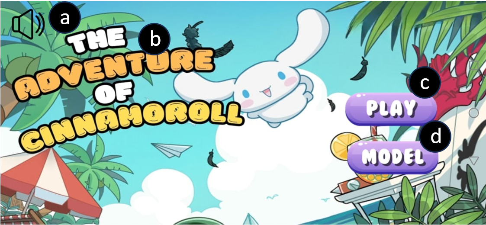

# The Adventure of Cinnamoroll

This application can play an animation titled 'The Adventure of Cinnamoroll' made by hologram videos of 3D Models. The 3D Models 'Macaron', 'Peach Juice Drink' and 'Police Car' were rendered in Blender while the other models were imported from the Internet. The application is developed in Unity and exported as an APK file, allowing it to be installed and run on mobile devices.

## UI Explanation

  
a)	Sound on/off button : Toggle to turn on/off the music  
b)	The title of the story  
c)	Play button : Click to play the video  
d)	Model button : Click to access the 3D models used in the video  
  
  
a)	Return button : Click to return to home page  
b)	3D Models button : Click on each button to view the respective model  
c)	3D Models button : Click on each button to view the respective model
d)	Model Image : Shows the model’s image when its button is clicked
  
  
a)	Return button : Click to return to home page  
b)	Video Player : Plays the hologram video  

